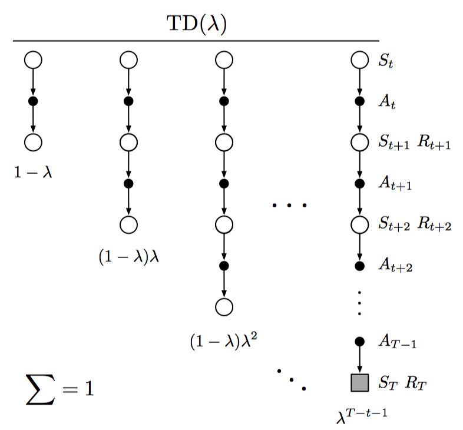
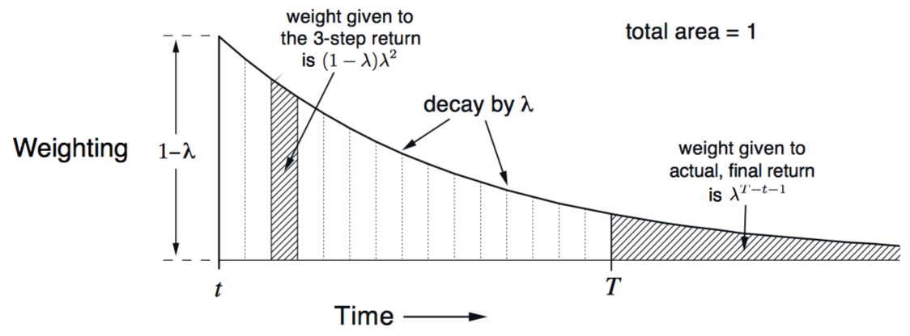
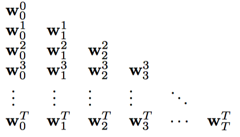
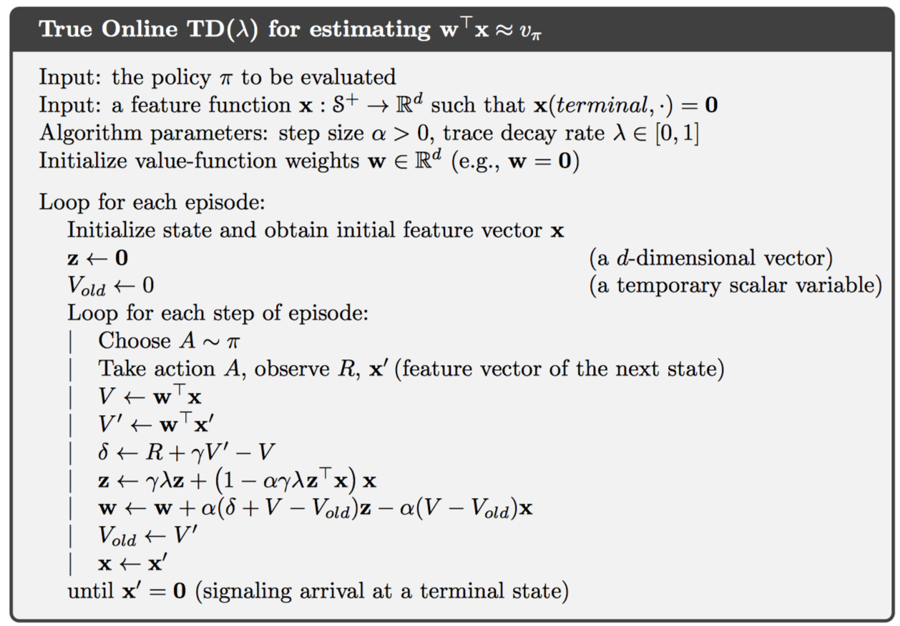
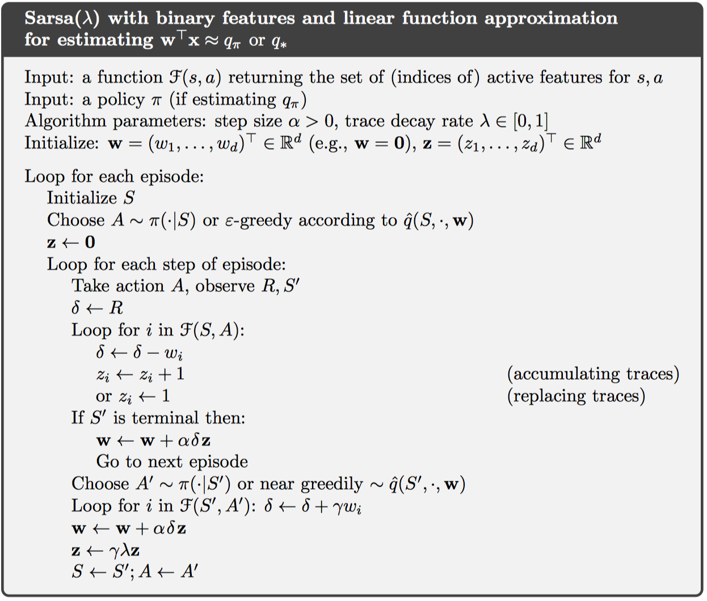
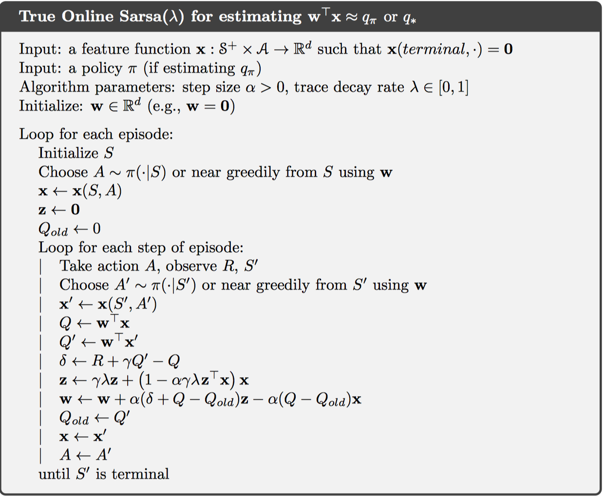
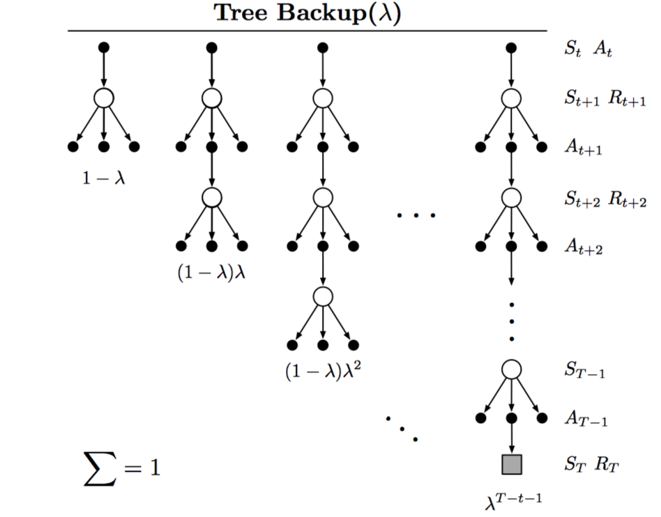

# Chapter 12 Eligibility Traces

Eligibility Traces是强化学习的一种基本方法，几乎所有的时间差分算法都可以结合eligibility traces得到更好的结果。

在TD方法结合eligibility traces中，得到一系列融合TD和MC的通用方法。

eligibility traces方法中，只需要一个trace vector，因此可以在时间序列上连续学习，低延迟；并且学习可以即刻作用于行为。

此外，eligibility traces有两种方式，包括forward views和backward views。

## 12.1 The λ-return

在第7章中，展示了n-step TD的方法。这里定义新的返回值为任意多个n-step返回值的加权均值，其中，权重之和为1。这样的更新方式称为compound update。一个复合更新完成必须要在最长的部分更新完成之后。

而TD(λ)则是平均n-step更新的一种特殊形式，返回值称为λ-return，公式如下：
$$
G _ { t } ^ { \lambda } \doteq ( 1 - \lambda ) \sum _ { n = 1 } ^ { \infty } \lambda ^ { n - 1 } G _ { t : t + n }\\
G _ { t } ^ { \lambda } = ( 1 - \lambda ) \sum _ { n = 1 } ^ { T - t - 1 } \lambda ^ { n - 1 } G _ { t t + n } + \lambda ^ { T - t - 1 } G _ { t }
$$

当λ为0时，更新只包含第一个部分，即one-step TD更新；当λ为1时，更新只包含最后一个部分，即MC更新。权重为递减趋势，如下所示：

因此，可以得到离线lambda-return算法，权重更新如下：
$$
\mathbf { w } _ { t + 1 } \doteq \mathbf { w } _ { t } + \alpha \left[ G _ { t } ^ { \lambda } - \hat { v } \left( S _ { t } , \mathbf { w } _ { t } \right) \right] \nabla \hat { v } \left( S _ { t } , \mathbf { w } _ { t } \right) , \quad t = 0 , \ldots , T - 1
$$
当lambda连续变化时，算法在MC和one-step TD中连续移动，同样，取一个合适的中间值时，性能达到最优。此外，这样的学习算法也成为forward view形式。

## 12.2 TD(λ)

这里提供一种离线lambda-return的近似算法，TD(λ)。其具有三个优点：1. 在每个时间步更新权重，而不是片段末尾；2. 其计算平均分布在每个时间步，而不是集中在片段末尾；3. 可以应用到连续式任务，而不仅仅片段任务。

定义一个短期记忆向量eligibility trace vector，如下：
$$
\mathbf { z } _ { - 1 } \doteq \mathbf { 0 }\\
\mathbf { z } _ { t } \doteq \gamma \lambda \mathbf { z } _ { t - 1 } + \nabla \hat { v } \left( S _ { t } , \mathbf { w } _ { t } \right) , \quad 0 \leq t \leq T
$$
其中，γ为奖励的折扣比率，λ为前一章中介绍的权重递减参数。这个向量记录了近期每个权重的哪一部分对当前状态做出什么样的贡献，即将近期所有权重更新方式按照权重递增进行加权求和。更新如下：
$$
\mathbf { w } _ { t + 1 } \doteq \mathbf { w } _ { t } + \alpha \delta _ { t } \mathbf { z } _ { t }\\
\delta _ { t } \doteq R _ { t + 1 } + \gamma \hat { v } \left( S _ { t + 1 } , \mathbf { w } _ { t } \right) - \hat { v } \left( S _ { t } , \mathbf { w } _ { t } \right)
$$
这样的方式间接实现了前一节中的离线lambda-return算法，并且将forward views形式转换为backward views形式。每一个时间步，将当前的TD error分配到所有前向状态中，依据的是每个状态对当前eligibility trace vector的贡献程度。

同样，TD(0)为one-step TD，TD(1)为MC更新。

在使用在线策略的情况下，线性TD(λ)被证明可以收敛。

## 12.3 n-step Truncated λ-return Methods

在第一节中，提到的离线lambda-return算法，依赖所有的n-step returns加权均值，并且权重递减。一种近似方式可以将后期权重十分小的部分直接摒弃，得到截断lambda-return，定义如下：
$$
G _ { t \cdot h } ^ { \lambda } \doteq ( 1 - \lambda ) \sum _ { n = 1 } ^ { h - t - 1 } \lambda ^ { n - 1 } G _ { t : t + n } + \lambda ^ { h - t - 1 } G _ { t : h } , \quad 0 \leq t < h \leq T
$$

使用该return的更新算法称为Truncated TD(λ)算法或者TTD(λ)算法，如下：
$$
\mathbf { w } _ { t + n } \doteq \mathbf { w } _ { t + n - 1 } + \alpha \left[ G _ { t : t + n } ^ { \lambda } - \hat { v } \left( S _ { t } , \mathbf { w } _ { t + n - 1 } \right) \right] \nabla \hat { v } \left( S _ { t } , \mathbf { w } _ { t + n - 1 } \right)
$$
在实现中，可以借鉴n-step TD中的更新，在前n-1步不做任何更新，而后面每一个时间步进行更新，相当于更新延迟n-1步。

## 12.4 Redoing Updates: The Online λ-return Algorithm

在截断TD(λ)中，截断参数n的选择面临一个平衡。一方面，应该选择大一些，可以更加近似离线lambda-return算法；另一方面，应该选择小一些，可以得到更小的时延。

这一节中，介绍一种在线lambda-return算法，在同样截断参数的情况，该在线算法可以得到更好地结果。一个例子如下：
$$
\begin{aligned}
h = 1: &\quad \mathbf { w } _ { 1 } ^ { 1 } \doteq \mathbf { w } _ { 0 } ^ { 1 } + \alpha \left[ G _ { 0 : 1 } ^ { \lambda } - \hat { v } \left( S _ { 0 } , \mathbf { w } _ { 0 } ^ { 1 } \right) \right] \nabla \hat { v } \left( S _ { 0 } , \mathbf { w } _ { 0 } ^ { 1 } \right)\\
h = 2: &\quad \mathbf { w } _ { 1 } ^ { 2 } \doteq \mathbf { w } _ { 0 } ^ { 2 } + \alpha \left[ G _ { 0 : 2 } ^ { \lambda } - \hat { v } \left( S _ { 0 } , \mathbf { w } _ { 0 } ^ { 2 } \right) \right] \nabla \hat { v } \left( S _ { 0 } , \mathbf { w } _ { 0 } ^ { 2 } \right) \\ &\quad \mathbf { w } _ { 2 } ^ { 2 } \doteq \mathbf { w } _ { 1 } ^ { 2 } + \alpha \left[ G _ { 1 : 2 } ^ { \lambda } - \hat { v } \left( S _ { 1 } , \mathbf { w } _ { 1 } ^ { 2 } \right) \right] \nabla \hat { v } \left( S _ { 1 } , \mathbf { w } _ { 1 } ^ { 2 } \right) \\
h = 3: &\quad \mathbf { w } _ { 1 } ^ { 3 } \doteq \mathbf { w } _ { 0 } ^ { 3 } + \alpha \left[ G _ { 0 : 3 } ^ { \lambda } - \hat { v } \left( S _ { 0 } , \mathbf { w } _ { 0 } ^ { 3 } \right) \right] \nabla \hat { v } \left( S _ { 0 } , \mathbf { w } _ { 0 } ^ { 3 } \right) \\ &\quad \mathbf { w } _ { 2 } ^ { 3 }  \doteq \mathbf { w } _ { 1 } ^ { 3 } + \alpha \left[ G _ { 13 } ^ { \lambda } - \hat { v } \left( S _ { 1 } , \mathbf { w } _ { 1 } ^ { 3 } \right) \right] \nabla \hat { v } \left( S _ { 1 } , \mathbf { w } _ { 1 } ^ { 3 } \right) \\ &\quad \mathbf { w } _ { 3 } ^ { 3 } \doteq \mathbf { w } _ { 2 } ^ { 3 } + \alpha \left[ G _ { 2 : 3 } ^ { \lambda } - \hat { v } \left( S _ { 2 } , \mathbf { w } _ { 2 } ^ { 3 } \right) \right] \nabla \hat { v } \left( S _ { 2 } , \mathbf { w } _ { 2 } ^ { 3 } \right)
\end{aligned}
$$
即截断参数从1迭代到n，在每个截断更新内，起始时间点依次递增，权重逐次更新，如下：

一个通用的更新公式如下：
$$
\mathbf { w } _ { t + 1 } ^ { h } \doteq \mathbf { w } _ { t } ^ { h } + \alpha \left[ G _ { t : h } ^ { \lambda } - \hat { v } \left( S _ { t } , \mathbf { w } _ { t } ^ { h } \right) \right] \nabla \hat { v } \left( S _ { t } , \mathbf { w } _ { t } ^ { h } \right) , \quad 0 \leq t < h \leq T
$$
最终得到$\mathbf { w } _ { t } \doteq \mathbf { w } _ { t } ^ { t }$，即为在线lambda-return算法。其计算负责度更高，但性能也更优，因为使用到了更多的更新信息。

## 12.5 True Online TD(λ)

上一节中是forward views形式，仍然可以转换为高效的backward views形式。称为true online是因为相比12.2中的TD(λ)而言，该在线形式更加全面。

对于线性拟合形式而言，$\hat { v } ( s , \mathbf { w } ) = \mathbf { w } ^ { \top } \mathbf { x } ( s )$，则真在线TD更新为：
$$
\mathbf { w } _ { t + 1 } \doteq \mathbf { w } _ { t } + \alpha \delta _ { t } \mathbf { z } _ { t } + \alpha \left( \mathbf { w } _ { t } ^ { \top } \mathbf { x } _ { t } - \mathbf { w } _ { t - 1 } ^ { \top } \mathbf { x } _ { t } \right) \left( \mathbf { z } _ { t } - \mathbf { x } _ { t } \right)\\
\mathbf { z } _ { t } \doteq \gamma \lambda \mathbf { z } _ { t - 1 } + \left( 1 - \alpha \gamma \lambda \mathbf { z } _ { t - 1 } ^ { \top } \mathbf { x } _ { t } \right) \mathbf { x } _ { t }
$$
该算法被证明可以和上一节中的序列权重得到完全一致的结果。与传统的TD(λ)相比，每个时间步的内存消耗相同，但计算增加50%，复杂度仍然是o(d)。

此外，eligibility trace应用在true online TD(λ)中称为dutch trace，应用在12.2中的TD(λ)称为accumulating trace，还有一种称为replacing trace。

## 12.6 Dutch Traces in Monte Carlo Learning

Dutch Traces不仅可以应用在TD算法中，在之前的MC算法中，同样可以应用dutch traces方法实现backward views形式。使得所有计算平均分布在每一个时间步，并且不需要保存每一步的特征向量。

取一种特殊的情况，只存在片段末尾的奖励，并且无折扣机制，即Least Mean Square规则，权重更新如下：
$$
\begin{aligned}
\mathbf { w } _ { T } &= \mathbf { F } _ { T - 1 } \mathbf { w } _ { T - 1 } + \alpha G \mathbf { x } _ { T - 1 }\\
\mathbf { F } _ { t} & = \mathbf { a } _ { T - 1 } + \alpha G \mathbf { z } _ { T - 1 }\\
\mathbf { z }_t &= \mathbf { z } _ { t - 1 } + \left( 1 - \alpha \mathbf { z } _ { t - 1 } ^ { \top } \mathbf { x } _ { t } \right) \mathbf { x } _ { t }\\
\mathbf { a } _ { t } &\doteq \mathbf { F } _ { t } \mathbf { F } _ { t - 1 } \cdots \mathbf { F } _ { 0 } \mathbf { w } _ { 0 } = \mathbf { F } _ { t - 1 } - \alpha \mathbf { x } _ { t } \mathbf { x } _ { t } ^ { \top } \mathbf { a } _ { t - 1 } , \quad 1 \leq t < T
\end{aligned}
$$
具体推导这里省略，每一个时间步，迭代更新$a_t$和$z_t$向量，在片段末尾，得到G，然后对权重进行更新。

由此可见，这种eligibility traces的方法适用于任何解决长期预测的问题。

## 12.7 Sarsa(λ)

使用12.2中的TD(λ)更新可以得到Sarsa(λ)控制算法，只需要更改状态值函数为动作值函数，权重更新与12.2中相同，如果使用线性拟合，二进制特征，则伪代码如下：

此外，如果使用true online TD更新，则得到true online Sarsa(λ)控制算法，如下：

## 12.8 Variable λ and γ

如果采用一种更加通用的算法，则可以令参数λ和γ也分别是一个函数，即$\lambda _ { t } \doteq \lambda \left( S _ { t } , A _ { t } \right)$，$\gamma _ { t } \doteq \gamma \left( S _ { t } \right)$。

因此，定义返回值如下：
$$
 G _ { t } = \sum _ { k = t } ^ { \infty } R _ { k + 1 } \prod _ { i = t + 1 } ^ { k } \gamma _ { i }
$$
为了使得该和是有限的，需要满足$\prod _ { k = t } ^ { \infty } \gamma _ { k } = 0$

新的Sarsa中lambda-return定义为：
$$
G _ { t } ^ { \lambda a } \doteq R _ { t + 1 } + \gamma _ { t + 1 } \left( \left( 1 - \lambda _ { t + 1 } \right) \hat { q } \left( S _ { t + 1 } , A _ { t + 1 } , \mathbf { w } _ { t } \right) + \lambda _ { t + 1 } G _ { t + 1 } ^ { \lambda a } \right)
$$
新的期望Sarsa中返回值为：
$$
G _ { t } ^ { \lambda a } \doteq R _ { t + 1 } + \gamma _ { t + 1 } \left( \left( 1 - \lambda _ { t + 1 } \right) \overline { V } _ { t } \left( S _ { t + 1 } \right) + \lambda _ { t + 1 } G _ { t + 1 } ^ { \lambda a } \right)
$$

## 12.9 Off-policy Eligibility Traces with Control Variates

略过

## 12.10 Watkins’s Q(λ) to Tree-Backup(λ)

将Q-learning扩展到eligibility traces的方法称为Watkins’s Q(λ)，如下图所示：

将Tree-backup扩展到eligibility traces的方法称为Tree-Backup(λ)，或者TB(λ)，如下图所示：

其实，Q-learning和expected sarsa可以看做Tree-backup的一种特殊形式，因此，下文主要介绍TB(λ)的公式。

返回值定义如下：
$$
G _ { t } ^ { \lambda a } \doteq R _ { t + 1 } + \gamma _ { t + 1 }  ( \left( 1 - \lambda _ { t + 1 } \right) \overline { V } _ { t } \left( S _ { t + 1 } \right) + \lambda _ { t + 1 } \left[ \sum _ { a \neq A _ { t + 1 } } \pi ( a | S _ { t + 1 } ) \hat { q } \left( S _ { t + 1 } , a , \mathbf { w } _ { t } \right) + \pi \left( A _ { t + 1 } | S _ { t + 1 } \right) G _ { t + 1 } ^ { \lambda a } \right] \\
= R _ { t + 1 } + \gamma _ { t + 1 } \left( \overline { V } _ { t } \left( S _ { t + 1 } \right) + \lambda _ { t + 1 } \pi \left( A _ { t + 1 } | S _ { t + 1 } \right) \left( G _ { t + 1 } ^ { \lambda a } - \hat { q } \left( S _ { t + 1 } , A _ { t + 1 } , \mathbf { w } _ { t } \right) \right) \right)
$$
此外，为方便起见，也可以写作是TD error的和，如下：
$$
G _ { t } ^ { \lambda a } \approx \hat { q } \left( S _ { t } , A _ { t } , \mathbf { w } _ { t } \right) + \sum _ { k = t } ^ { \infty } \delta _ { k } ^ { a } \prod _ { i = t + 1 } ^ { k } \gamma _ { i } \lambda _ { i } \pi \left( A _ { i } | S _ { i } \right)
$$
和前几节中一样，定义eligibility traces vector如下：
$$
\mathbf { z } _ { t } \doteq \gamma _ { t } \lambda _ { t } \pi \left( A _ { t } | S _ { t } \right) \mathbf { z } _ { t - 1 } + \nabla \hat { q } \left( S _ { t } , A _ { t } , \mathbf { w } _ { t } \right)
$$
值得注意的是，当使用离线数据或者强大的拟合函数时，TB(λ)并不保证一定收敛。

## 12.11 Stable Off-policy Methods with Traces

Gradient-TD：GTD(λ)，GQ(λ)，HTD(λ)

Emphatic-TD：Emphatic TD(λ)

## 12.12 Implementation Issues

略过

## 12.13 Conclusions

与TD方法结合的eligibility traces方法，提供了一种高效的、连续的从MC到一步TD的更新方法。其主要包括在线和离线算法、forward views和backward views等。

使用eligibility traces的方法需要更多的计算量，但延迟更低，使用于在线学习。此外，在一些离线情况中，这种方法并不适合。