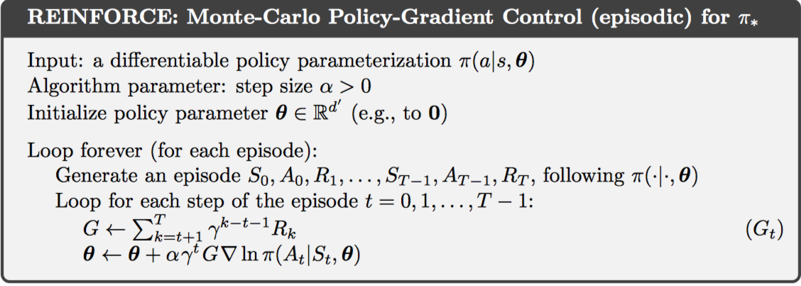
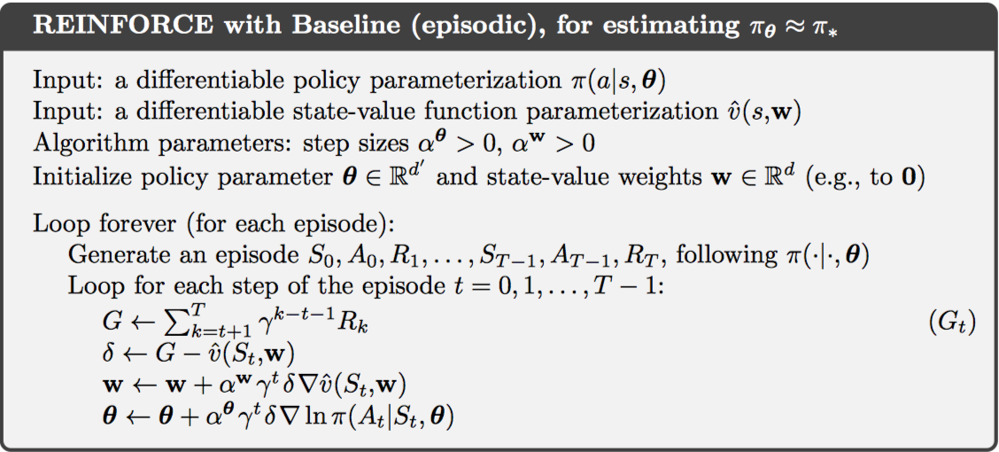
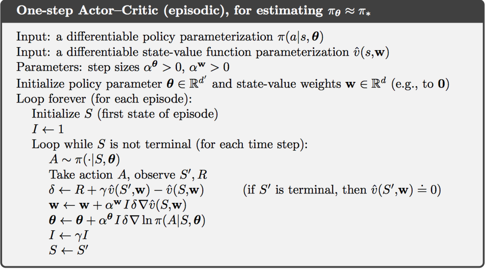
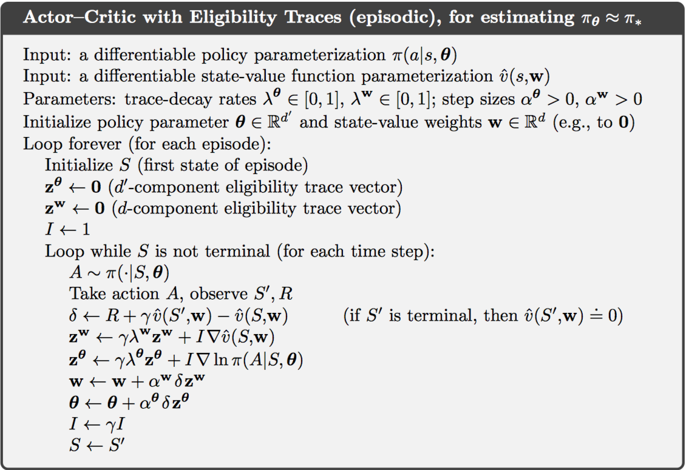
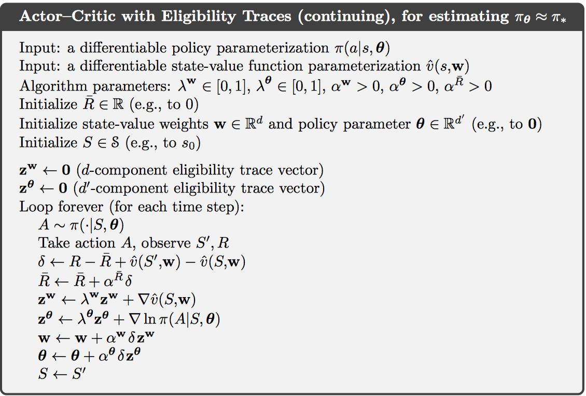

# Chapter 13 Policy Gradient Methods

之前所学到的都是基于动作值函数的方法，这一章则是参数化策略的方法。因此，定义策略为如下数学式：
$$
\pi ( a | s , \theta ) = \operatorname { Pr } \left\{ A _ { t } = a | S _ { t } = s , \theta _ { t } = \theta \right\}
$$
并且使用$J ( \theta )$衡量模型的好坏，使用梯度下降法更新权重如下：
$$
\boldsymbol { \theta } _ { t + 1 } = \boldsymbol { \theta } _ { t } + \alpha \overline { \nabla J \left( \boldsymbol { \theta } _ { t } \right) }
$$
凡是遵循这种模式的方法都称作策略梯度的方法，其中，同时学习值函数的方法称作actor-critic。

## 13.1 Policy Approximation and its Advantages

首先是离散动作空间的方法。通常可以得到每个状态-动作对的数字化偏好程度$h ( s , a , \theta ) \in \mathbb { R }$，直接选择最大值对应动作即可。如果使用softmax处理，则可以得到完整的概率分布，如下：
$$
\pi ( a | s , \boldsymbol { \theta } ) \doteq \frac { e ^ { h ( s , a , \boldsymbol { \theta } ) } } { \sum _ { b } e ^ { h ( s , b , \boldsymbol { \theta } ) } }
$$
上述这种形式的参数化策略称作softmax in action preferences，其中的h函数可以采用任意的拟合方法，如神经网络等等。

相较于动作值函数的方法，参数化策略有以下优点：

1. 最终可以得到一个确定的策略，而$\epsilon-greedy$有一定概率随机选择动作。
2. 允许以任意概率选择某个动作。
3. 策略函数可能更加直接，并且拟合更加简单。
4. 便于添加先验知识。

## 13.2 The Policy Gradient Theorem

除了上节中优点之外，策略梯度的方法使得动作概率可以平滑变化，而不是像$\epsilon-greedy$中动作可能发生突变。正是由于依赖于策略连续性，使得策略梯度的方法逼近梯度上升过程。

针对片段式任务而言，定义评价指标为起始状态的值函数，如下：
$$
J ( \boldsymbol { \theta } ) \doteq v _ { \pi _ { \boldsymbol { \theta } } } \left( s _ { 0 } \right)
$$
以上指标依赖于状态分布，计算对于策略参数的梯度值较为困难。因此，有策略梯度定理如下，不涉及状态分布：
$$
\nabla J ( \theta ) \propto \sum _ { s } \mu ( s ) \sum _ { a } q _ { \pi } ( s , a ) \nabla \pi ( a | s , \theta )
$$
在片段式任务中，比例值取片段的平均长度；对于连续式任务，则取1。

## 13.3 REINFORCE: Monte Carlo Policy Gradient

上一节中的策略梯度定理可以改写为期望形式，如下：
$$
\left.\begin{aligned} \nabla J ( \boldsymbol { \theta } ) & \propto \sum _ { s } \mu ( s ) \sum _ { a } q _ { \pi } ( s , a ) \nabla \pi ( a | s , \boldsymbol { \theta } ) \\ & = \mathbb { E } _ { \pi } \left[ \sum _ { a } q _ { \pi } \left( S _ { t } , a \right) \nabla \pi ( a | S _ { t } , \boldsymbol { \theta } ) \right]  \\
&= \mathbb { E } _ { \pi } \left[ q _ { \pi } \left( S _ { t } , A _ { t } \right) \frac { \nabla \pi \left( A _ { t } | S _ { t } , \boldsymbol { \theta } \right) } { \pi \left( A _ { t } | S _ { t } , \boldsymbol { \theta } \right) } \right]\\
& = \mathbb { E } _ { \pi } \left[ G _ { t } \frac { \nabla \pi \left( A _ { t } | S _ { t } , \boldsymbol { \theta } \right) } { \pi \left( A _ { t } | S _ { t } , \boldsymbol { \theta } \right) } \right]
\end{aligned} \right.
$$
其中，Gt即为返回值，则权重更新公式如下：
$$
\boldsymbol { \theta } _ { t + 1 } \doteq \boldsymbol { \theta } _ { t } + \alpha G _ { t } \frac { \nabla \pi \left( A _ { t } | S _ { t } , \boldsymbol { \theta } _ { t } \right) } { \pi \left( A _ { t } | S _ { t } , \boldsymbol { \theta } _ { t } \right) }
$$
这个算法也称作REINFORCE算法，因为使用了某个时刻的完整返回值，因此REINFORCE也是一种MC算法，只定义在片段式任务中。

上图中给出的算法替换为对数导数，并且引入了折扣情况。

这种REINFORCE算法具有高方差的特点，学习过程较慢。

## 13.4 REINFORCE with Baseline

上一节中的策略梯度定理可以扩展到baseline的情况，如下：
$$
\nabla J ( \theta ) \propto \sum _ { s } \mu ( s ) \sum _ { a } \left( q _ { \pi } ( s , a ) - b ( s ) \right) \nabla \pi ( a | s , \theta )
$$
只要满足baseline函数与动作a无关即可，则权重跟新如下：
$$
\boldsymbol { \theta } _ { t + 1 } \doteq \boldsymbol { \theta } _ { t } + \alpha \left( G _ { t } - b \left( S _ { t } \right) \right) \frac { \nabla \pi \left( A _ { t } | S _ { t } , \boldsymbol { \theta } _ { t } \right) } { \pi \left( A _ { t } | S _ { t } , \boldsymbol { \theta } _ { t } \right) }
$$
带baseline的REINFORCE算法，使得更新的期望值不变，但方差大大降低。一种常见的baseline选择方式是动作值函数，因此只需要同时学习动作值函数网络的参数即可。

该算法有两个步长，需要手动设置如何调整。

## 13.5 Actor–Critic Methods

尽管带baseline的REINFORCE算法同时学习动作值函数和策略，但仍不是actor-critic算法，因为没有使用自引导机制。通过自引导和依赖状态表示所引入的偏差通常是有益的，因为这可以降低方差，并且加速学习。而带baseline的REINFORCE是无偏的。

one-step actor-critic将返回值替换为one-step return即可，如下：
$$
\left.\begin{aligned} \boldsymbol { \theta } _ { t + 1 } &\doteq \boldsymbol { \theta } _ { t } + \alpha \left( G _ { t : t + 1 } - \hat { v } \left( S _ { t } , \mathbf { w } \right) \right)  \frac { \nabla \pi \left( A _ { t } | S _ { t } , \boldsymbol { \theta } _ { t } \right) } { \pi \left( A _ { t } | S _ { t } , \boldsymbol { \theta } _ { t } \right) } \\ & = \boldsymbol { \theta } _ { t } + \alpha \left( R _ { t + 1 } + \gamma \hat { v } \left( S _ { t + 1 } , \mathbf { w } \right) - \hat { v } \left( S _ { t } , \mathbf { w } \right) \right) \frac { \nabla \pi \left( A _ { t } | S _ { t } , \boldsymbol { \theta } _ { t } \right) } { \pi \left( A _ { t } | S _ { t } , \boldsymbol { \theta } _ { t } \right) } \\ & = \boldsymbol { \theta } _ { t } + \alpha \delta _ { t } \frac { \nabla \pi \left( A _ { t } | S _ { t } , \boldsymbol { \theta } _ { t } \right) } { \pi \left( S _ { t } | S _ { t } , \boldsymbol { \theta } _ { t } \right) } \end{aligned} \right.
$$
状态值函数可以使用semi-gradient TD(0)的方法进行学习。

上述是一种前向算法，而后向的$\lambda$-return算法也十分常用，完整的伪代码如下：

## 13.6 Policy Gradient for Continuing Problems

对于连续式任务，定义评价指标为每个时刻奖励的均值，如下：
$$
\left.\begin{aligned} J ( \boldsymbol { \theta } ) \doteq r ( \pi ) & \doteq \lim _ { h \rightarrow \infty } \frac { 1 } { h } \sum _ { t = 1 } ^ { h } \mathbb { E } \left[ R _ { t } | A _ { 0 : t - 1 } \sim \pi \right] \\ & = \lim _ { t \rightarrow \infty } \mathbb { E } \left[ R _ { t } | A _ { 0 : t - 1 } \sim \pi \right] \\ & = \sum _ { s } \mu ( s ) \sum _ { a } \pi ( a | s ) \sum _ { s ^ { \prime } , r } p \left( s ^ { \prime } , r | s , a \right) r \end{aligned} \right.
$$
另外，定义的值函数也都是差值值函数。

## 13.7 Policy Parameterization for Continuous Actions

之前所讨论的都是离散动作空间，对于连续动作空间，需要学习一个概率分布。例如，策略可以定义为实数动作，而动作选择的概率对应为高斯概率密度函数上的值，需要学习的则是高斯函数的均值和方差。

## 13.8 Summary

这一章主要介绍直接学习参数化策略的方法，即策略梯度的方法。

核心原理是策略梯度定理。算法包括REINFORCE、带baseline的REINFORCE和actor-critic等。