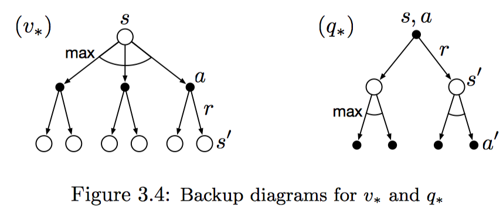

# Chapter 3: Finite Markov Decision Processes(有限马尔科夫决策过程)

## 3.1 The Agent–Environment Interface(个体和环境接口)
有限马尔科夫决策过程是一种交互式的问题导向学习问题。包括个体和环境，个体可以学习制作决定，所有个体之外的因素包含在环境中。

上述为马尔科夫随机过程的循环图，如果展开为一个时间序列，可以为：S0,A0,R1,S1,A1,R2,S2,A2,R3,...

如果对于有限马尔科夫随机过程而言，这个序列是有限个的，即时间步数是有限的。这种情况下，下一个时间步的Rt和St都服从一个固定的离散概率分布，且只与其前一个状态和前一个动作相关，数学定义如下：

$$
p \left( s ^ { \prime } ,r | s ,a \right) \doteq \operatorname{Pr} \left\{ S _ { t } = s ^ { \prime } ,R _ { t } = r | S _ { t - 1} = s ,A _ { t - 1} = a \right\}
$$

这个概率p包含四个参数，可以完全描述一个有限马尔科夫随机过程。也可以派生出一些其他的表达式，如状态转移概率，获得奖励的期望等等。

MDP只是一种抽象的问题定义，对于不同的任务还需要具体化。一般来说，动作为我们需要去学习的决策，而状态则是那些可以帮助我们学习决策的任何东西。同样，对于个体和环境的边界的定义，仍然在不同的问题中不太一样。一般来说，不可以被个体任意改变的东西被认为是属于环境的，而其他则是属于个体的。这种边界表现了个体的控制局限性，但并不代表个体的知识局限性，即个体可能知道环境是如何运作的，但却依然无法改变环境获得最大奖励。

任何目标导向的学习问题都可以简化为MDP的三要素，即动作、状态和奖励。因此，解决一个问题，包含两个步骤：如何将问题表示为MDP过程的三要素？如何基于MDP的表示，求最优解？

## 3.2 Goals and Rewards(目标和奖励)
在强化学习中，学习目标是一个数学化的奖励信号，并且这个奖励不是即时计算的，而是定义为假设奖励（reward hypothsis）：即最大化一段时间内所有累计奖励的期望。

使用奖励信号形式化描述学习目标是强化学习一个重要特征。

此外，强化学习的奖励并不包含先验知识，即这个奖励只是让个体明确其终极目标，而并不告知个体如何去实现它，应注意，个体在实现这个奖励最大化的过程中，可能存在很多子目标，这些子目标不属于奖励的范围内。

## 3.3 Returns and Episodes(返回值和片段)
通常情况下，使用返回值作为所有奖励的和，最大化返回值作为直接目标。对于片段式任务，即天然离散有限个时间点，交互过程可以看到多个独立重复的时间片段。定义返回值如下：

$$
G _ { t } \doteq R _ { t + 1} + R _ { t + 2} + R _ { t + 3} + \cdots + R _ { T }
$$

除了片段式任务，还包括连续式任务，即交互过程无法天然划分为多个片段，连续进行下去，没有时间限制。这种任务使用折扣返回值度量，如下：

$$
G _ { t } \doteq R _ { t + 1} + \gamma R _ { t + 2} + \gamma ^ { 2} R _ { t + 3} + \cdots = \sum _ { k = 0} ^ { \infty } \gamma ^ { k } R _ { t + k + 1}
$$

$\gamma$表示折扣率，折扣率小于1时，折扣返回值在连续式任务中是有限大的。当其等于0时，称之为短视的，即返回值只等于当前奖励；而返回值接近于1的时候，称之为长视的，计算也更加困难。

## 3.4 Unified Notation for Episodic and Continuing Tasks(片段任务和连续任务的统一表示)

上一节中介绍的片段任务和连续任务都有着不同的返回值表达方式。对于片段式任务而言，假设只考虑一个片段，其他片段同理，则可以直接使用一个片段的时间步来表示交互过程。对于终止状态而言，后面引入吸收状态。吸收状态下，reward为0，并且只转移到自身。这样一来，在返回值不变的情况下，将片段任务和连续任务的返回值可以共同表示为如下表达式：

$$
G _ { t } \doteq \sum _ { k = t + 1} ^ { T } \gamma ^ { k - t - 1} R _ { k }
$$

其中，T可以为无穷大，$\gamma$可以为1。

## 3.5 Policies and Value Functions(策略和值函数)
几乎所有的机器学习问题都需要定义值函数，用于衡量当前状态有多好，或者当前状态下给定动作有多好。此外，策略指的是在给定状态下，选择不同动作的概率映射，为$\pi ( a | s )$。

对于值函数，有两种定义，一种是给定状态和往后策略下的期望返回值，称作对于策略$\pi$的状态值函数。

$$
v _ { \pi } ( s ) \doteq \mathbb { E } _ { \pi } \left[ G _ { t } | S _ { t } = s \right] = \mathbb { E } _ { \pi } \left[ \sum _ { k = 0} ^ { \infty } \gamma ^ { k } R _ { t + k + 1} | S _ { t } = s \right] ,\text{ for all } s \in \delta
$$

第二种是给定当前状态下的动作，并且基于策略$\pi$，输出期望返回值，也称作对于策略$\pi$的动作值函数。

$$
q _ { \pi } ( s ,a ) \doteq \mathbb { E } _ { \pi } \left[ G _ { t } | S _ { t } = s ,A _ { t } = a \right] = \mathbb { E } _ { \pi } \left[ \sum _ { k = 0} ^ { \infty } \gamma ^ { k } R _ { t + k + 1} | S _ { t } = s ,A _ { t } = a \right]
$$

值函数往往从经验数据中估计得出，对于状态值函数而言，计算每个状态下的返回值均值，根据大数定理，时间步数无穷大时，均值将逼近返回值期望；对于动作值函数而言，同理对每个动作计算返回值均值。这种估计方法也称作蒙特卡洛搜索。

值函数一般满足可递归性，对于状态值函数而言，数学表达式如下：

$$
v _ { \pi } ( s ) = \sum _ { a } \pi ( a | s ) \sum _ { s ^ { \prime } ,r } p \left( s ^ { \prime } ,r | s ,a \right) \left[ r + \gamma v _ { \pi } \left( s ^ { \prime } \right) \right] ,\quad \text{ for all } s \in S
$$

这个公式也称作值函数$v_{\pi}$的贝尔曼方程，可以看做所有$s,a,s^{'}$组合的概率对下一个状态下值函数的加权求和。此外，还可以使用回溯图可视化展示。值得注意的是，这里的回溯图与上文中的转移图不同，状态转移图类似自动机，每一个节点代表一个唯一的状态；而回溯图中不同节点可能代表同一个状态。

## 3.6 Optimal Policies and Optimal Value Functions(最优策略和最优值函数)

最优策略意味着，该策略下所有状态的值函数大于等于其余策略。

最优状态值函数如下：
$$
v _ { * } ( s ) \doteq \max _ { \pi } v _ { \pi } ( s )
$$

最优动作值函数如下：

$$
q _ { * } ( s ,a ) \doteq \max _ { \pi } q _ { \pi } ( s ,a )
$$

对于最优状态值函数来说，其不依赖于一个特定的策略；另外，它是一个值函数，可以转换为贝尔曼方程，这也称作贝尔曼最优方程：

$$
v _ { * } ( s ) = \max _ { a \in \mathcal { A } ( s ) } q _ { \pi _ { * } } ( s ,a )\\
= \max _ { a } \mathbb { E } _ { \pi _ { * } } \left[ G _ { t } | S _ { t } = s ,A _ { t } = a \right]\\
= \max _ { a } \mathbb { E } _ { \pi * } \left[ R _ { t + 1} + \gamma G _ { t + 1} | S _ { t } = s ,A _ { t } = a \right]\\
= \max _ { a } \mathbb { E } \left[ R _ { t + 1} + \gamma v _ { * } \left( S _ { t + 1} \right) | S _ { t } = s ,A _ { t } = a \right] \\
= \max _ { a } \sum _ { s ^ { \prime } ,r } p \left( s ^ { \prime } ,r | s ,a \right) \left[ r + \gamma v _ { * } \left( s ^ { \prime } \right) \right]
$$

对于最优动作值函数同理。

此外，也可以使用回溯图来表示这两个方程，与普通值函数的回溯比较，最优值函数的回溯图是在所有可能动作选择中取最大值，而普通值函数直接在所有动作中取加权平均。

有了最优状态值函数，可以直接使用一步前向搜索的方式确定最优策略。对于任意一个状态s，通过贝尔曼最优方程可以得到一个或者多个动作选择，那些只对这些动作赋予概率大于0的策略，被认为是最优策略。这种方式也可以看做是贪婪搜索。使用最优值函数进行贪婪搜索的方式，将求解长期最优期望返回值，转化为对每个状态本身进行局部求解。这样一来，一步前向搜索可以得到长期最优动作。

使用贝尔曼最优方程求解最优策略，基于三个假设：1. 精确了解环境的动态变化；2. 有足够的计算资源；3. 马尔科夫性。很多情况下，第二个假设无法满足，求解贝尔曼最优方程十分困难，实际中我们往往只需要求得贝尔曼最优方程的近似解，包括动态规划、层次搜索等方法。

## 3.7 Optimality and Approximation(最优性和近似性)

完全求解MDP问题，需要大量的计算资源和大量的内存。之前一些简单的有限状态MDP问题，可以使用列表格等方式计算所有可能情况，这种问题也称作表格问题，求解方式称作表格方式。

此外，使用强化学习的方法解决MDP问题，只需要求得近似解。强化学习的在线性质，使得有可能更多地学习如何为经常遇到的状态作出正确决策，从而来近似最优策略，代价是对不经常遇到的状态，关注度不够。