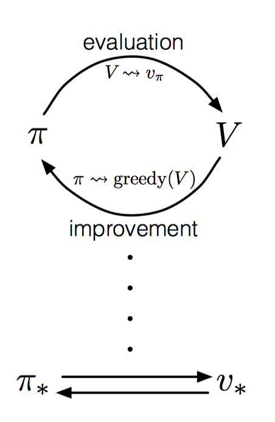
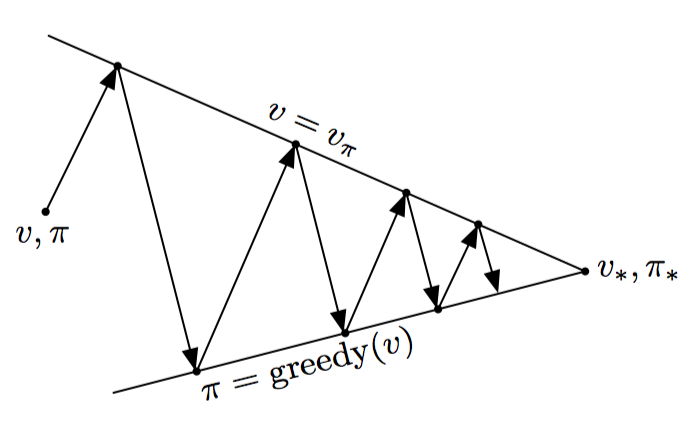

# chapter 4 Dynamic Programming(动态规划)
动态规划（DP）指的是一组可以用来计算最佳策略的算法，需要给定一个完美的环境模型作为马尔可夫决策过程（MDP）。

## 4.1 Policy Evaluation (策略估计)
首先需要计算给定策略下的状态值函数，这也称作策略估计，或者预测问题。

依据贝尔曼方程，有如下公式：

$$
v _ { \pi } ( s )= \sum _ { a } \pi ( a | s ) \sum _ { s ^ { \prime } ,r } p \left( s ^ { \prime } ,r | s ,a \right) \left[ r + \gamma v _ { \pi } \left( s ^ { \prime } \right) \right]
$$

可以发现，可以构造S个方程的方程组，并且有S个未知数。从而这个方程组是可解的。这里使用迭代求解的方式，给定时间序列，可以得到一系列值函数的估计，如下：

$$
v _ { k + 1} ( s ) \quad \doteq \quad \mathbb { E } _ { \pi } \left[ R _ { t + 1} + \gamma v _ { k } \left( S _ { t + 1} \right) | S _ { t } = s \right] \\
= \sum _ { a } \pi ( a | s ) \sum _ { s ^ { \prime } ,r } p \left( s ^ { \prime } ,r | s ,a \right) \left[ r + \gamma v _ { k } \left( s ^ { \prime } \right) \right]
$$

当k趋于无穷大时，值函数的估计将逼近真实状态值函数。这种方式也称作迭代策略评估。其中，每一步的计算称作期望更新，因为这个计算过程是基于所有可能的状态的，而不仅仅只是样本数据中的状态。

再具体实现过程中，有两种方式：1. 使用两个矩阵，分别保存旧的值函数和新计算的值函数，迭代更新；2. 使用一次矩阵保存值函数，每次就地更新函数值。可以发现，第二种方式可 以更快地逼近真实期望，使用中需要注意选择状态的顺序，这可能会对收敛的速率产生影响。

## 4.2 Policy Improvement（策略改进）
在现有策略条件下，我们需要知道是否应该改变策略，来获取最优值函数。这里，使用策略改进的方式来改变策略。

对于当前策略$\pi$来说，在状态s时，改变为选择动作a，其余状态策略不变，得到新策略$\pi^{'}$。如果有$q _ { \pi } \left( s ,\pi ^ { \prime } ( s ) \right) \geq v _ { \pi } ( s )$，则可以推导得到$v _ { \pi ^ { \prime } } ( s ) \geq v _ { \pi } ( s )$。即说明，新的策略更优。

因此，我们可以使用贪婪策略，利用当前值函数，对每一个状态选择最优的动作作为新策略。

$$
\pi ^ { \prime } ( s ) \quad \doteq \quad \arg \max _ { a } q _ { \pi } ( s ,a )
$$

值得注意的是，策略提升每次都会得到一个较优的策略，除非原始策略已经是最优的，这样一来，可以保证这种方式最终一定会收敛到最优策略。此外，如果有多个最优选择，应该给每个选择都赋予一定概率，任何分配策略都应该保证次优的分配零概率。

## 4.3 Policy Iteration（策略迭代）
基于上节中的计算，可以重复进行策略评估和策略提升的过程，如下所示：

每一次策略提升过程，都会获得严格更优的值函数，除非之前已经是最优策略和最优值函数。此外，假设是有限MDP，即存在有限个策略，故而这种迭代方式，最终一定会收敛到最优策略和最优值函数。

## 4.4 Value Iteration（值迭代）
上面的策略迭代过程，在策略评估阶段，需要扫描若干次状态，耗时较长。实际中并不需要得到非常精确的值函数。可以将上述过程修改为一次扫描、一次策略提升。数学形式如下：

$$
\left.\begin{aligned} v _ { k + 1} ( s ) & \doteq \max _ { a } \mathbb { E } \left[ R _ { t + 1} + \gamma v _ { k } \left( S _ { t + 1} \right) | S _ { t } = s ,A _ { t } = a \right] \\ & = \max _ { a } \sum _ { s ^ { \prime } ,r } p \left( s ^ { \prime } ,r | s ,a \right) \left[ r + \gamma v _ { k } \left( s ^ { \prime } \right) \right] \end{aligned} \right.
$$

这种方式称作值迭代，也可以看做是贝尔曼最优方程的更新形式。此外，如果需要更快的收敛，可以多个策略评估扫描和一个策略提升，这也可以看做是一个序列化的扫描过程，一些扫描实现策略评估，一些扫描实现值迭代，它们唯一的区别在于是否采用最大化操作。

## 4.5 Asynchronous Dynamic Programming（异步动态规划）
上文中介绍的都是同步动态规划，即每次都需要进行完整的扫描，耗时长。故而可以采用异步动态规划算法，每次随机选取一些状态进行在线更新。然而为了保证可以收敛，需要保证持续更新所有状态，即不能在某次计算过后，忽略任何状态。

这种异步动态规划算法，保证了很好的灵活性，即可以组成状态更新的顺序，以一种效率非常高的顺序进行。此外，还可以实现实时交互更新，即在个体探索环境的过程中，应用DP算法更新值函数并选择策略。这种方式使得DP算法关注那些与个体相关的状态。

## 4.6 Generalized Policy Iteration（通用策略迭代）
策略迭代包括两个部分：策略估计和策略改进。一般情况下，一个过程收敛后，开启另一个过程。但也有特殊情况，值迭代的方法则是在策略估计的每一轮扫描后，直接进行策略改进。而异步动态规划的方法，使得评估和改进的过程在更细致的颗粒上进行，单个状态会在一个进程中更新，然后返回到另一个策略改进的进程中，只要两个进程都持续进行下去，这些方法最终都会收敛到最优值函数和最优策略。

这里可以使用通用策略迭代（GPI）表示策略估计和策略改进的交互过程。如下图所示：策略总是依据当前值函数进行改进，而值函数总是根据改进后的策略进行更新。这样一来，两者互相驱动，最终收敛到最优策略和最优值函数。

此外，GPI过程还可以看做是两者的竞争与协作，即每次策略提升会使得值函数不准确，而使得值函数准确符合当前策略，又会使得当前策略不再贪婪。长期运行后，最终收敛。

如果换一种角度，可以将两者的交互过程，看做两个直线寻找相交点的过程。评估和提升分别寻找自己的最优值，但一个最优后，另一个不再最优，两者互相协作。在这个过程中，逐渐达到全局最优。

## 4.7 Efficiency of Dynamic Programming（动态规划的效率）
动态规划的时间复杂度是状态数量和动作数量的多项式。相比线性规划而言，动态规划更适合处理更大的问题。

但动态规划仍然会遭遇维度爆炸问题，即伴随状态变量的数量变化，实际的状态数量会以指数增长。实践中，好的初始值函数和初始策略，往往能更快收敛。对于更大的状态空间问题来说，异步动态规划算法往往更具有效率。因为在寻找最优策略的过程中，可能只需要少量的状态。