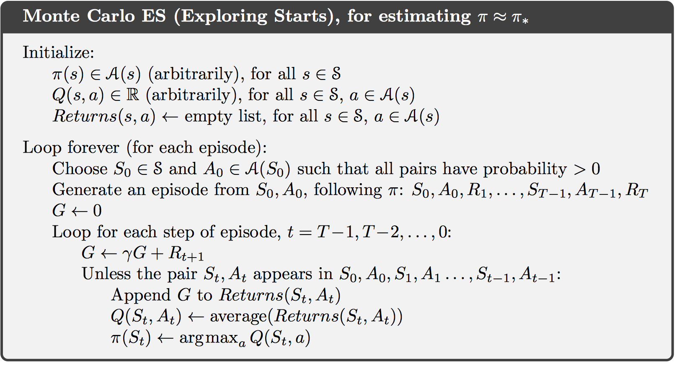
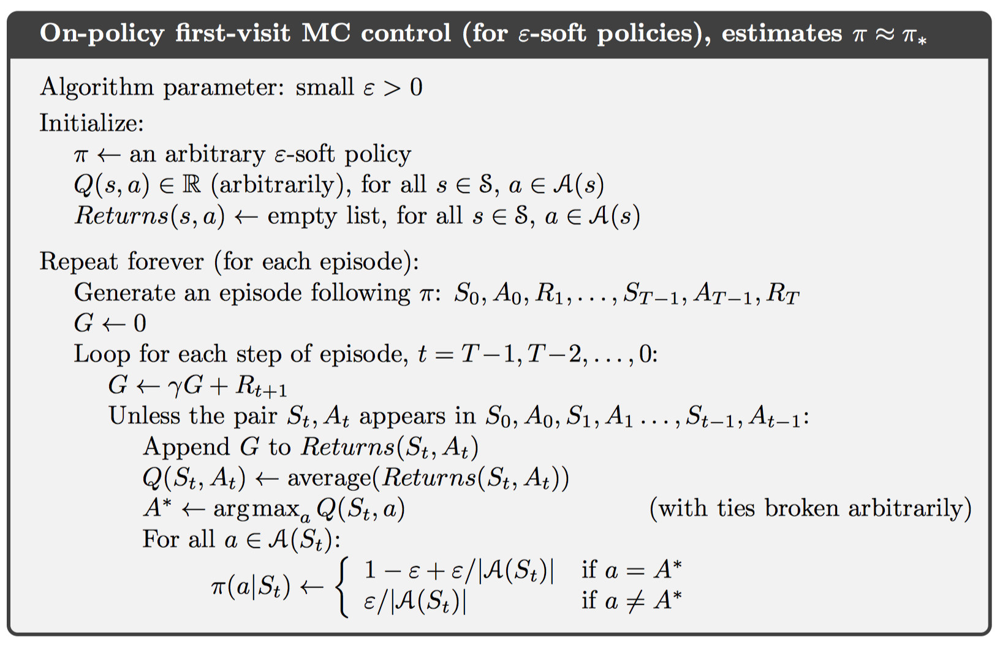
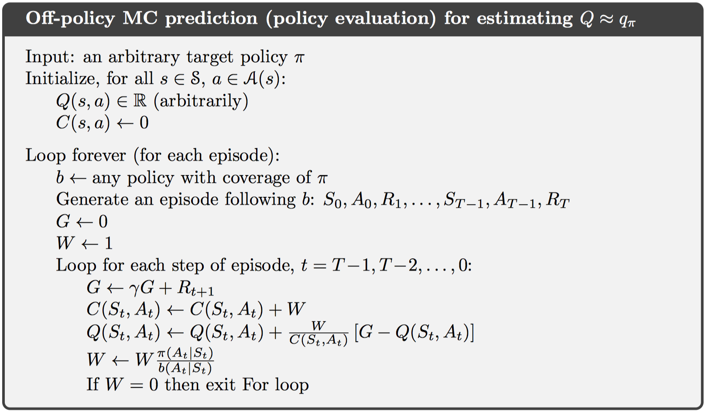
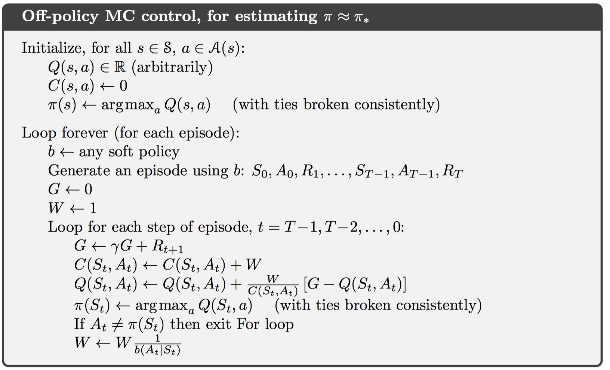

# chapter 5 Monte Carlo Methods（蒙特卡洛搜索）
相比于前一章的动态规划而言，蒙特卡洛的方法只需要实际经验，不需要对环境的先验知识，即可以在不了解任何概率分布的情况下，学习最优策略。此外，还可以从模拟经验学习。

蒙特卡洛方法实际是基于样例返回值的均值求解强化学习的一种方法。为了确保返回值是可计算的，蒙特卡洛搜索只适用于片段式任务。只有在片段终结时，策略和值函数才会发生改变。一般而言，术语“蒙特卡洛”泛指那些重点在随机变量的估计方法。这里，专指完全返回值均值的方法。

蒙特卡洛的方法相当于不稳定的多臂赌博机问题，需要使用通用策略迭代（GPI）算法解答。只不过在动态规划中，我们需要根据MDP知识计算值函数，而这里只能根据MDP的样例学习值函数。

## 5.1 Monte Carlo Prediction（蒙特卡洛预测）
在一个片段中，每次状态s的出现，都称作对s的一次访问。当然，一个片段中可能对s访问多次。因此，蒙特卡洛预测包含两种方法：first-visit MC method和every-visit MC method。首次访问MC方法只统计首次访问状态s的所有返回值，并求均值；而多次访问MC方法，统计所有访问状态s的返回值，并求均值。这一章中主要介绍首次访问的方法。

对首次访问MC来说，每一个返回值相互独立，并且具有相同的分布。利用大数定理，显而易见，两种方法都是值函数的无偏估计，随着采样次数逼近无穷大，均值最终收敛到值函数。

与DP类似，MC同样可以使用回溯图表示。不同的是，在MC方法中，只会画出基于一个任务片段的一个样例；而DP则会画出所有状态一步的转移情况。

此外，MC与DP最大的不同点在于，MC方法中每一个状态值函数的估计是相互独立的，即不支持自引导方式。而DP方法中，每个状态值函数的建立是基于其他状态值函数的。

这样一来，MC方法中，我们可以只估计一部分需要的状态值函数，而不与状态数量相关，忽略不需要的状态。这是MC相比DP的第三大优点。另外两大优点是从实际经验学习和从模拟经验学习。

## 5.2 Monte Carlo Estimation of Action Values（动作值函数的蒙特卡洛估计）
一般情况下，我们无法确定环境模型，即不知道状态s下动作a所产生的结果。这样一来，动作值函数的估计对于策略选择更加直接。

动作值函数估计与状态值函数估计类似，采用返回值均值的方法。但如果使用一个确定的策略去探索，可能会使得状态s只与动作a相关，而其他状态-动作对永远不会被探索。这也称作保持性探索。

一种解决方法是在初始化的时候，为每一个状态-动作对赋予非零概率，这会保证无穷大时间步时，每一个状态-动作对都被探索。另一种解决方法是只考虑那些从为所有状态-动作对赋予随机选择概率的策略。

## 5.3 Monte Carlo Control（蒙特卡洛控制）
类似DP中，使用GPI重复策略评估和策略提升来得到最优策略和最优值函数。在MC方法中，有两个假设：无限多的片段；片段使用探索开始。

这样一来，对一个动作值函数来说，可以得到其贪婪策略，如下：

$$
\pi ( s ) \doteq \arg \max _ { a } q ( s ,a )
$$

与DP中类似，这样的方法每次都可以得到严格更优的策略，除非之前的策略已经是最优策略。

注意到之前的两个假设，其中无限多的片段无法在算法中实现，有两个解决方案：1. 每次测量值函数的误差，使其足够小即可；2. 类似DP中值迭代的方案，对于每个片段，进行一次策略评估的迭代和一轮策略提升。注意这里策略评估并没有得到精确的值函数，而只是一次迭代过程。这种方法称作Monte Carlo with Exploring Starts（Monte Carlo ES）。

当片段足够多时，最后可以收敛到最优策略和最优值函数。但这个过程还未得到正式的数学证明，仍然是强化学习中的一个开放性问题。

## 5.4 Monte Carlo Control without Exploring Starts（不带探索开始的蒙特卡洛控制）
前几节中仍然使用了探索开始的假设，不适用该假设有两种解决方案：在线策略和离线策略。在线策略的方式主要改进如何生成策略的方式；而离线策略方式，主要改进如何生成数据的方式。

在线策略中，使用软策略生成方式，即对任何状态-动作对，都有$\pi ( a | s ) > 0$存在。一种方式是使用$\epsilon-贪婪$策略方式，每次以$1-\epsilon$概率选择贪婪策略，$\epsilon$概率从所有动作中随机选择。因此，贪婪策略选择概率为$1- \varepsilon + \frac { \varepsilon } { | A ( s ) | }$，非贪婪动作选择概率为$\frac { \varepsilon } { | \mathcal { A } ( s ) | }$，故而可以保证$\pi ( a | s ) \geq \frac { \varepsilon } { | A ( s ) | }$存在，满足软策略要求。并且在所有软策略中，$\epsilon-贪婪$策略是最接近贪婪策略的。

剩余部分是证明$\epsilon-贪婪$每次都会得到更优或者相同值函数的策略，并且最终可以收敛到所有软策略中的最优值。

## 5.5 Off-policy Prediction via Importance Sampling（基于重要性采样的离线预测）
所有强化学习控制方法都会遇到一个困境：它们试图学习以最优行为为条件的代价函数，但是在寻找过程中往往需要探索所有非最优行为。使用在线策略的方法做出了一些妥协，即同时学习一些次优策略。而离线学习的方法更加直接，设定两个策略，一个为目标策略，是需要学习成为最优策略的，而另一个为行为策略，使用它产生行为数据。

值得注意的是，在线策略只是离线策略的一个特例，即目标策略和行为策略相同。

这种离线策略方案具有更大的方差，并且收敛速度更慢；但适用性更广。离线策略中有覆盖假设：即如果目标策略对于某个状态-动作概率大于零，则行为策略中该状态-动作概率一定也大于零，即对于那些目标策略未明确指定的状态-动作对，行为策略随机分配。一般情况下，目标策略可以是贪婪策略，而行为策略可以是$\epsilon-贪婪$策略。

注意这一节中，假设目标策略是给定的、不变的，只关注预测算法。

几乎所有离线策略都遵循重要性采样，即使用重要性采样比率描述目标策略和行为策略对于给定状态s的值函数比值。

重要性采样比率数学形式如下：

$$
\rho _ { t : T - 1} \doteq \frac { \prod _ { k = t } ^ { T - 1} \pi \left( A _ { k } | S _ { k } \right) p \left( S _ { k + 1} | S _ { k } ,A _ { k } \right) } { \prod _ { k = t } ^ { T - 1} b \left( A _ { k } | S _ { k } \right) p \left( S _ { k + 1} | S _ { k } ,A _ { k } \right) } = \prod _ { k = t } ^ { T - 1} \frac { \pi \left( A _ { k } | S _ { k } \right) } { b \left( A _ { k } | S _ { k } \right) }
$$

注意这里在推导过程中引入分布概率p，但一般情况下这个概率是未知的。可以看到推导完后，实际比率与概率并不相关，只与策略有关。

这样一来，可以引出两种蒙特卡洛预测算法，分别为普通重要性采样和加权重要性采样，区别在于分母中的权值不同。

$$
V ( s ) \doteq \frac { \sum _ { t \in \mathbf { T } ( s ) } \rho _ { t : T ( t ) - 1} G t } { | \mathcal { J } ( s ) | }
$$

$$
V ( s ) \doteq \frac { \sum _ { t \in \mathbf { T } ( s ) } \rho _ { t : T ( t ) - 1} G t }{\sum _ { t \in J ( s ) } \rho _ { t : T ( t ) -1} }
$$

这两种采样方法主要差别在于偏差和方差，普通重要性采样是无偏估计，而方差大；加权重要性采样是有偏估计，但偏差逐渐收敛到0，且方差小。一般情况下，加权重要性采样更常用。在策略轨迹包含循环时，普通重要性采样的方差常常会变为无穷大。

## 5.6 Incremental Implementation（增量实现）
采用类似2.4节中在多臂赌博机中给出的增量算法，这里仍然使用增量计算的方式求解均值。对于在线策略和普通重要性采样算法都是直接套用。

对于加权重要性算法，修改公式如下：
$$
V _ { n + 1} \doteq V _ { n } + \frac { W _ { n } } { C _ { n } } \left[ G _ { n } - V _ { n } \right] ,\quad n \geq 1 \\
C _ { n + 1} \doteq C _ { n } + W _ { n + 1}
$$

值得注意的是，在线策略只是离线策略的一个特例：$\pi=b$，且权值为1。给定目标策略$\pi$，一个完整的基于离线策略蒙特卡洛预测算法如下：

## 5.7 Off-policy Monte Carlo Control（离线蒙特卡洛控制）
目前有两种学习控制算法：在线策略和离线策略。

在离线策略的蒙特卡洛控制算法中，行为策略需要覆盖目标策略，并且使用软策略机制。

此外，行为策略b需要满足一个条件，即必须对每个状态-动作对都得到无限多的返回值。这一点可以使用$\epsilon-soft$策略保证。

这种算法的一个潜在问题：当片段中剩余所有动作都是贪婪的时候，其只会在片段末尾学习，而不会同时选择多个贪婪动作。即某个状态只可能对应一个贪婪动作。

## 5.8 *Discounting-aware Importance Sampling
## 5.9 *Per-decision Importance Sampling

## Summary（总结）
蒙特卡洛方法相比动态规划而言，有以下优点：

- 可以直接从环境交互中学习最优策略
- 可以从模拟环境中学习
- 可以只关注部分状态，而忽略其他状态的值函数
- 不需要遵守马尔科夫性，无自引导

MC方法仍然需要遵守GPI的方法，其基于一个一个片段实现策略估计和策略提升。

MC的一个问题是需要保证足够的探索，无论是在线策略还是离线策略，都需要遵守这一点。

DP是一种使用模型学习，并且自引导的模型；MC是一种从经验学习，无自引导的模型；下一章的时间差分学习是一种从经验学习，并且自引导的模型。