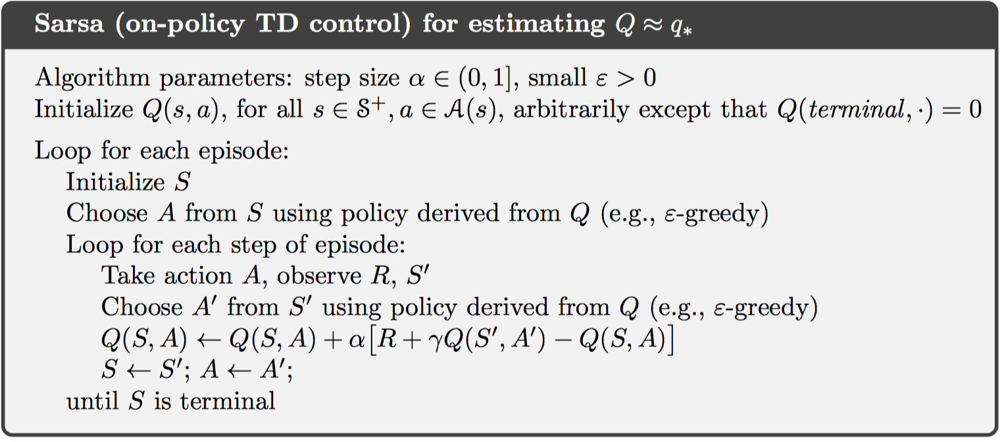
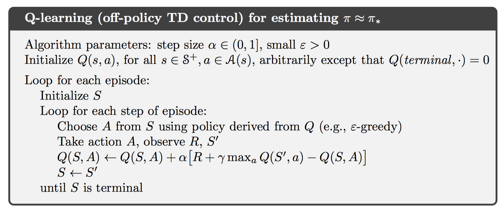
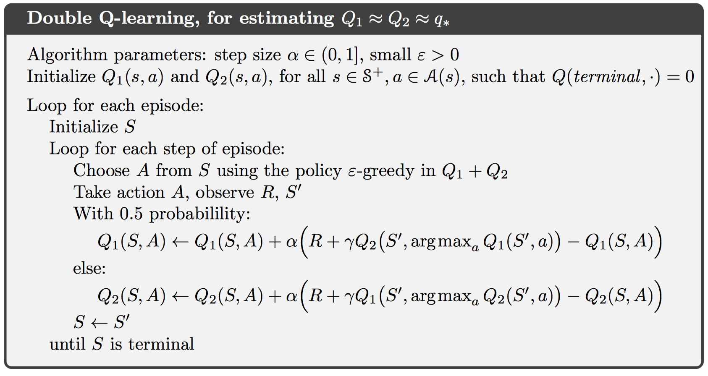

# chapter 6 Temporal-Difference Learning（时间差分学习）
时间差分学习既可以从环境中直接交互式学习，也可以使用自引导的方式来更新估计值。

## 6.1 TD Prediction（TD预测算法）

在MC方法中，值函数只在每一个片段结束后进行更新，因为返回值需要在片段结束后进行计算。而TD方法在每一个时间点都会根据当前奖励对值函数即时更新。公式如下：

$$
V \left( S _ { t } \right) \leftarrow V \left( S _ { t } \right) + \alpha \left[ R _ { t + 1} + \gamma V \left( S _ { t + 1} \right) - V \left( S _ { t } \right) \right]
$$

这种TD方法也称作TD(0)，是n-step TD的一种特殊情况。一步TD方法是基于其他状态值函数对当前状态值函数进行估计，故而是自引导的方法。

$$
\begin{aligned} 
v _ { \pi } ( s ) & \doteq \mathbb { E } _ { \pi } \left[ G _ { t } | S _ { t } = s \right] \\ 
& = \mathbb { E } _ { \pi } \left[ R _ { t + 1} + \gamma G _ { t + 1} | S _ { t } = s \right] \\ 
& = \mathbb { E } _ { \pi } \left[ R _ { t + 1} + \gamma v _ { \pi } \left( S _ { t + 1} \right) | S _ { t } = s \right] \end{aligned}
$$

如上述公式所示，MC方法是一种估计，因为第一个公式的期望值是未知的；DP方法是一种估计，因为下一个状态的值函数是未知的，采用V(St+1)估计。而TD方法是估计的，因为期望和下一个状态值函数都是未知的。故而TD方法结合了MC的采样和DP的自引导。

在DP中，更新方法称为期望更新，因为其更新方法基于样本的真实分布。而TD中，这种更新称为采样更新，其只基于当前采样状态-动作对。

此外，可以注意到TD(0)中更新值是一系列误差，这个误差称为TD误差，如下：

$$
\delta _ { t } \doteq R _ { t + 1} + \gamma V \left( S _ { t + 1} \right) - V \left( S _ { t } \right)
$$

实际在MC方法中，也存在误差的概念。MC误差实际是一系列TD误差的和，如下：

$$
G _ { t } - V \left( S _ { t } \right) = \sum _ { k = t } ^ { T - 1} \gamma ^ { k - t } \delta _ { k }
$$

值得注意的是，如果V在片段中实时更新，则这个等号并不精确，但步长不大的情况下，仍然近似相等。

## 6.2 Advantages of TD Prediction Methods（TD预测方法的优点）
相比DP而言，TD不需要对环境准确的建模；相比于MC而言，TD方法可以在线学习，非常自然的方式实现。

此外，很多情况下，TD方法较固定-alpha的MC方法而言，可以更快地收敛。

## 6.3 Optimality of TD(0)（TD的最优值）
TD(0)方法可以分为批处理和非批处理的。对于批处理更新，首先固定值函数，将一个片段中每一个时间点的值函数累计更新相加，在片段结束时，统一对值函数进行一次更新。而非批处理的方式，则如上一节中所述，每一时刻都进行值函数更新。

对于批处理的MC方法，其值函数估计值总是寻求训练集的最小均方误差；而批处理的TD(0)方法总是寻找马尔科夫过程模型的极大似然估计。一般来说，批处理的TD(0)方法总会收敛到确定性等价估计。

在批处理形式中，TD(0)方法比MC方法更快收敛，因为TD(0)计算的是确定性等价估计。而在非批处理形式中，TD(0)比MC方法更快收敛，因为TD(0)可以得到更好的估计值，尽管中间某些步可能并不是最优的。

虽然使用确定性等价估计可以得到最优解，但这种方式计算量过大，不可行。使用TD方法是逼近确定性等价解的唯一可行方法。

## 6.4 Sarsa: On-policy TD Control（Sarsa：在线TD控制）
在TD方式中，与MC类似，仍然会面临平衡探索和开发的问题，或者使用带软策略的在线策略，或者使用离线策略方式。

对于在线策略方式，与MC方式类似，需要估计动作值函数，而不是状态值函数。公式如下：

$$
Q \left( S _ { t } ,A _ { t } \right) \leftarrow Q \left( S _ { t } ,A _ { t } \right) + \alpha \left[ R _ { t + 1} + \gamma Q \left( S _ { t + 1} ,A _ { t + 1} \right) - Q \left( S _ { t } ,A _ { t } \right) \right]
$$

这个公式使用若干个$\left( S _ { t } ,A _ { t } ,R _ { t + 1} ,S _ { t + 1} ,A _ { t + 1} \right)$状态对，故而称作Sarsa算法。一个完整的控制流程如下：

值得注意的是，这里仍然使用$\epsilon-greedy$软策略方式生成策略。此外，若要Sarsa算法收敛到最优动作值函数，需要保证每一个状态-动作对访问无限次。

## 6.5 Q-learning: Off-policy TD Control（Q-learning：离线TD控制）
在离线控制中，可以直接学习最优动作值函数，而最优动作值函数与当前选择策略无关。使用预测算法Q-Learning如下：

$$
Q \left( S _ { t } ,A _ { t } \right) \leftarrow Q \left( S _ { t } ,A _ { t } \right) + \alpha \left[ R _ { t + 1} + \gamma \max Q \left( S _ { t + 1} ,a \right) - Q \left( S _ { t } ,A _ { t } \right) \right]
$$

一个完整的控制算法如下：

## 6.6 Expected Sarsa（期望Sarsa）
一种Sarsa的改进算法为期望Sarsa算法，即将Q-Learning中的求最大值改为求期望，公式如下：

$$
Q \left( S _ { t } ,A _ { t } \right) \leftrightarrow Q \left( S _ { t } ,A _ { t } \right) + \alpha \left[ R _ { t + 1} + \gamma \mathbb { E } \left[ Q \left( S _ { t + 1} ,A _ { t + 1} \right) | S _ { t + 1} \right] - Q \left( S _ { t } ,A _ { t } \right) \right]\\
\leftarrow Q \left( S _ { t } ,A _ { t } \right) + \alpha \left[ R _ { t + 1} + \gamma \sum \pi \left( a | S _ { t + 1} \right) Q \left( S _ { t + 1} ,a \right) - Q \left( S _ { t } ,A _ { t } \right) \right]
$$

Q-Learning算法和期望Sarsa算法的回溯图分别如下：

这里，可以将Q-Learning看做是期望Sarsa的一种特殊形式，则期望Sarsa也变成离线策略。一般而言，期望Sarsa是一种TD算法的通用形式，涵盖在线策略和离线策略。

## 6.7 Maximization Bias and Double Learning（最大值偏差和双重学习）
上述所有控制算法大多采用了最大值操作，例如Q-Learning。这样的最大值操作可能会带来最大值偏差，在估计初始阶段，偏差较大。

一种解决方案是可以采用双重学习技术，即独立使用两个值函数估计，一个用于选取最大值操作，另一个用于对某个动作选取值函数，即$Q _ { 1 } \left( \arg \max _ { a } Q _ { 2 } ( a ) \right)$。如果在Q-Learning中，则双重Q-Learning使用如下控制算法：

## 6.8 Games, Afterstates, and Other Special Cases（游戏，Afterstates和其他特殊情况）
一些特殊的任务具有特殊的值函数，例如填字游戏中，其值函数既不是状态值函数，也不是动作值函数，而是执行某个动作后的位置分布图对应状态的值函数。这种状态称为afterstates，值函数称为afterstates值函数。

这些特殊的情况仍然适用广义策略迭代方法，也需要考虑在线策略和离线策略来平衡探索和开发。