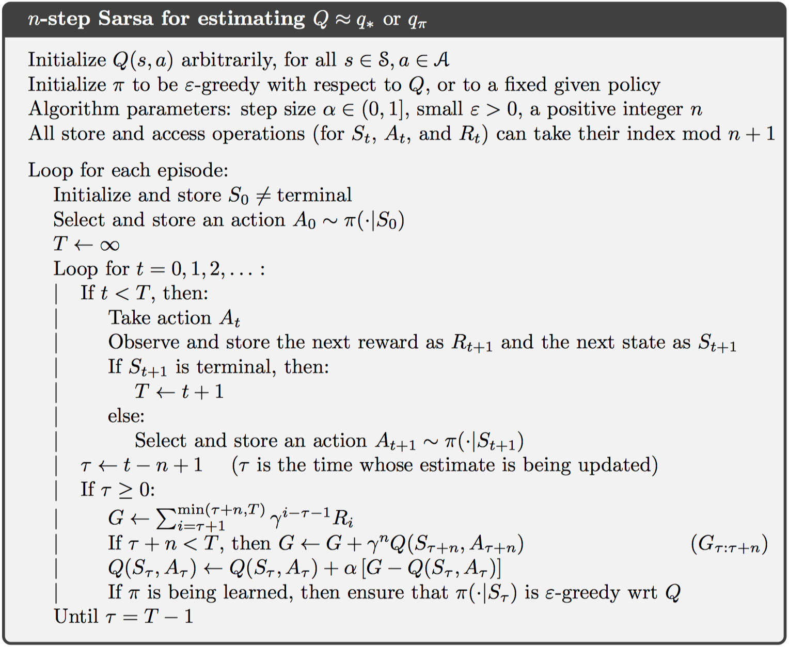
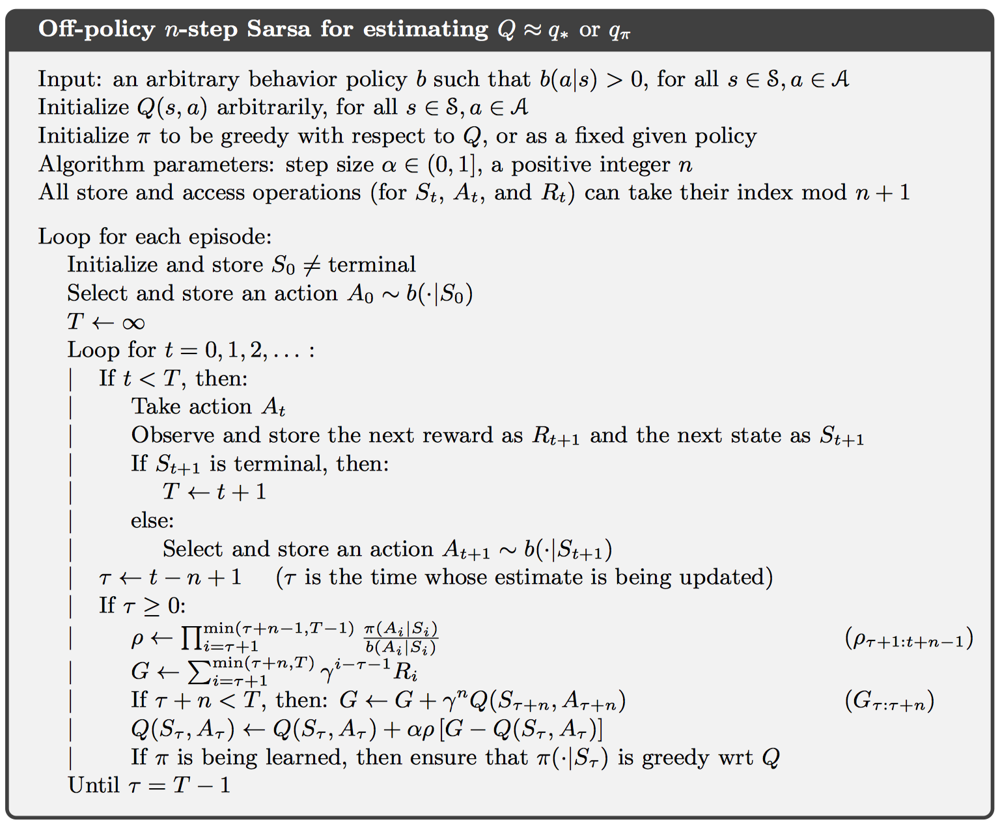
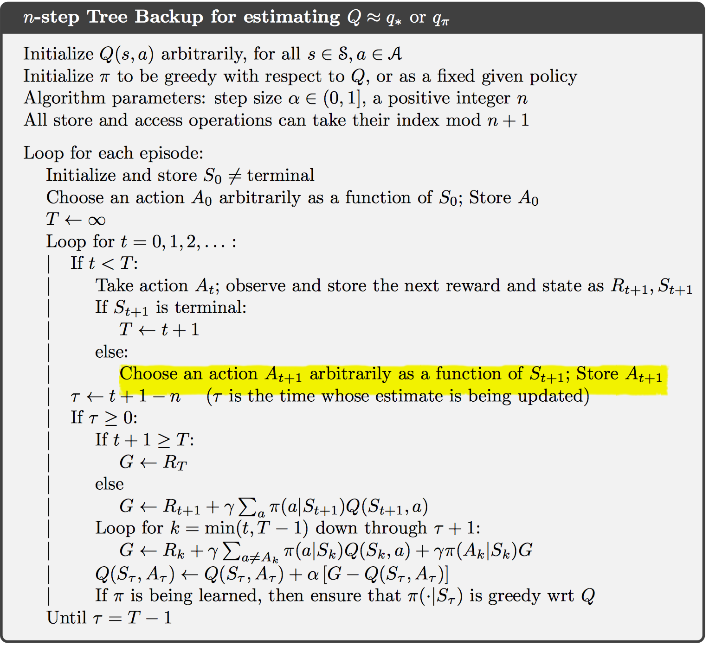
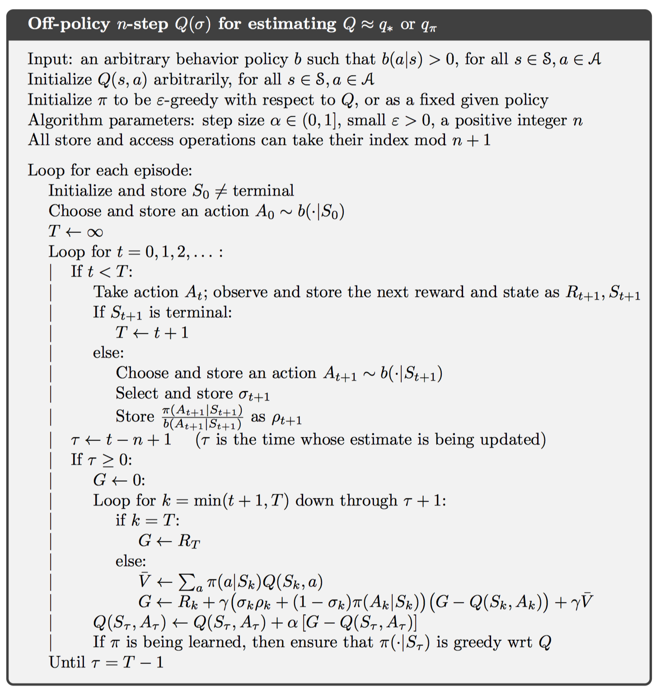

# Chapter 7 n-step Bootstrapping

n步TD方法是对MC和一步TD方法的融合，从而实现比MC和一步TD效果更好的方法。

## 7.1 n-step TD Prediction

在一步TD更新中，当前状态值函数估计值只依赖与其后第一个奖励和下一个状态值函数估计；而二步更新则依赖于其后两个奖励和之后第二个状态的值函数估计；因此，对n步更新而言，更新扩展到n步。

对MC而言，一个片段的返回值为：
$$
G _ { t } \doteq R _ { t + 1 } + \gamma R _ { t + 2 } + \gamma ^ { 2 } R _ { t + 3 } + \cdots + \gamma ^ { T - t - 1 } R _ { T }
$$
对一步TD返回值为：
$$
G _ { t : t + 1 } \doteq R _ { t + 1 } + \gamma V _ { t } \left( S _ { t + 1 } \right)
$$
对n步TD返回值为：
$$
G _ { t : t + n } \doteq R _ { t + 1 } + \gamma R _ { t + 2 } + \cdots + \gamma ^ { n - 1 } R _ { t + n } + \gamma ^ { n } V _ { t + n - 1 } \left( S _ { t + n } \right)
$$
这样一来，相当于n步TD更新推迟了n个时间步，则对于t到t+1的MDP过程而言，第一个更新的有效时间步为t+n。对于更新公式，这里仍然使用2.4节中的增量算法，并设置固定stepsize，即指数加权平均的方式：
$$
V _ { t + n } \left( S _ { t } \right) \doteq V _ { t + n - 1 } \left( S _ { t } \right) + \alpha \left[ G _ { t : t + n } - V _ { t + n - 1 } \left( S _ { t } \right) \right]
$$
其中，其他所有状态值保持不变。

在n步TD更新中，存在误差减小特性（error reduction property），即n步返回值的期望相对于真实状态值函数的误差，小于等于上一个时间步$V _ { t + n - 1 } ( s )$的误差，如下：
$$
\max _ { s } \left| \mathbb { E } _ { \pi } \left[ G _ { t : t + n } | S _ { t } = s \right] - v _ { \pi } ( s ) \right| \leq \gamma ^ { n } \max _ { s } \left| V _ { t + n - 1 } ( s ) - v _ { \pi } ( s ) \right|
$$
这样一来，可以保证n步TD更新最终会收敛到真实预测值。

## 7.2 n-step Sarsa

基于动作值函数确定控制策略更加直接，故而动作值函数更新公式如下：
$$
Q _ { t + n } \left( S _ { t } , A _ { t } \right) \doteq Q _ { t + n - 1 } \left( S _ { t } , A _ { t } \right) + \alpha \left[ G _ { t : t + n } - Q _ { t + n - 1 } \left( S _ { t } , A _ { t } \right) \right]
$$
其中，返回值为：
$$
G _ { t : t + n } \doteq R _ { t + 1 } + \gamma R _ { t + 2 } + \cdots + \gamma ^ { n - 1 } R _ { t + n } + \gamma ^ { n } Q _ { t + n - 1 } \left( S _ { t + n } , A _ { t + n } \right) , \quad n \geq 1,0 \leq t < T - n
$$

实验证明，这种n步更新方式使用了更多的信息，估计值更加准确。

对于期望Sarsa算法而言，只需要改变返回值中所依赖的动作值函数为动作值函数的期望即可，如下：
$$
\overline { V } _ { t } ( s ) \doteq \sum _ { a } \pi ( a | s ) Q _ { t } ( s , a ) , \quad \text { for all } s \in \delta
$$

## 7.3 n-step Off-policy Learning by Importance Sampling

在离线学习中，存在一个目标策略和行为策略，使用行为策略产生一系列奖励，并计算返回值。值得注意的是，这个返回值需要使用重要性采样机制修正为目标策略的返回值，如下所示：
$$
\rho _ { t : h } \doteq \prod _ { k = t } ^ { \min ( h , T - 1 ) } \frac { \pi \left( A _ { k } | S _ { k } \right) } { b \left( A _ { k } | S _ { k } \right) }
$$
因此，更新公式为：
$$
Q _ { t + n } \left( S _ { t } , A _ { t } \right) \doteq Q _ { t + n - 1 } \left( S _ { t } , A _ { t } \right) + \alpha \rho _ { t + 1 : t + n - 1 } \left[ G _ { t : t + n } - Q _ { t + n - 1 } \left( S _ { t } , A _ { t } \right) \right]
$$

对于期望sarsa而言，替换重要性采样中的$\rho _ { t + 1 : t + n - 1 }$为$\rho _ { t + 1 : t + n - 2 }$，返回值使用期望Sarsa的即可。

## 7.5 Off-policy Learning Without Importance Sampling: The n-step Tree Backup Algorithm

不带重要性采样的离线学习，称作树回退算法。其对于每一个时间步的所有动作都进行统计计算，并展开为一个树形图。其中，叶子节点为未访问过的动作，非叶子结点为当前执行的动作。最终的目标返回值包括实际奖励和所有叶子节点的值。

对于一步树回退算法而言，相当于期望Sarsa算法，如下：
$$
G _ { t : t + 1 } \doteq R _ { t + 1 } + \gamma \sum _ { a } \pi ( a | S _ { t + 1 } ) Q _ { t } \left( S _ { t + 1 } , a \right)
$$
对于n步树回退算法，更新如下：
$$
G _ { t : t + n } \doteq R _ { t + 1 } + \gamma \sum _ { a \neq A _ { t + 1 } } \pi ( a | S _ { t + 1 } ) Q _ { t + n - 1 } \left( S _ { t + 1 } , a \right) + \gamma \pi \left( A _ { t + 1 } | S _ { t + 1 } \right) G _ { t + 1 : t + n } , t < T - 1
$$
一个完整的控制算法如下：

## 7.6 *A Unifying Algorithm: n-step Q(σ)

这一节试图寻找一种统一的表示方式，来表示n步Sarsa，n步期望Sarsa，n步树回退算法等。

对于每一步计算一个函数$Q(σ)$，该值为1表示只计算采样值，该值为0表示计算所有动作的奖励。这样一来，更新公式如下：
$$
G _ { t : h } \doteq R _ { t + 1 } + \gamma \left( \sigma _ { t + 1 } \rho _ { t + 1 } + \left( 1 - \sigma _ { t + 1 } \right) \pi \left( A _ { t + 1 } | S _ { t + 1 } \right) \right) \left( G _ { t + 1 : h } - Q _ { h - 1 } \left( S _ { t + 1 } , A _ { t + 1 } \right) \right) + \gamma \overline { V } _ { h - 1 } \left( S _ { t + 1 } \right)
$$

## 7.7 Summary

n步自引导方法包括在线策略和离线策略，其中，在线策略为n步Sarsa算法。离线策略包括基于重要性采样的和基于树回退更新的。将这些都可以统一表示为n步Q(σ)算法。